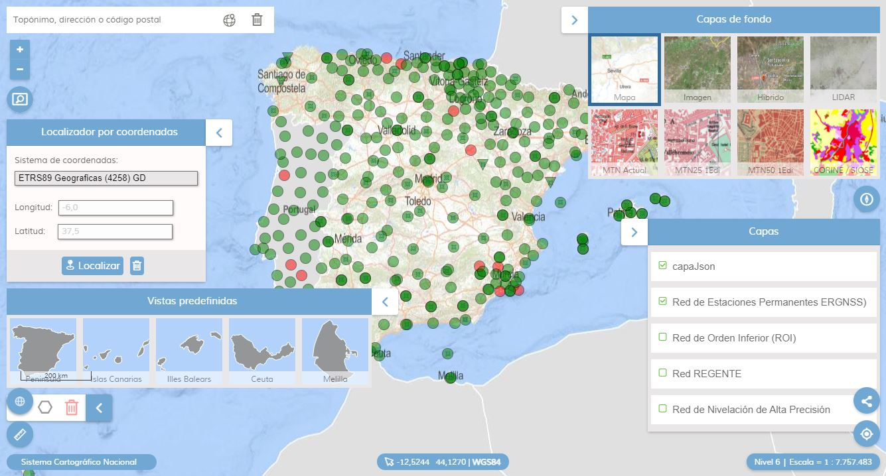

# 🚀 Arquetipo de visualizador

## 📚 Documentación

* 📰 Versiones de APIcore y Plugins [👉 Versiones](documents/apicore-releases.md).
* ⚙ Snippets de código [👉 Snippets](documents/snippets.md).
* 🎓 Conceptos
  * Capas raster WMS y WMTS [👉 Definición de capas raster](documents/concept-rasterLayers.md).
  * Capas raster XYZ [👉 Definición de capas raster](documents/concept-rasterXYZ.md).
* 🔌 Plugins
  *  [BackImageLayer] [👉 Configurando el BackImageLayer](documents/plugin-BackImgLayer.md).

## 🎖 Oficial

* Repositorios de proyectos
  * ⚙ Repositorio del [APICNIG](https://github.com/IGN-CNIG/API-CNIG)
  * ⚙ Solución [MAPEA de la Junta de Andalucía](https://sigcorporativo-ja.github.io/)
* Wiki oficiales
  * 📝 Wiki MAPEA Junta de Andalucía con la [documentación](https://github.com/sigcorporativo-ja/Mapea4/wiki)
  * 📝 Wiki oficial con la [documentación](https://github.com/IGN-CNIG/API-CNIG/wiki)
* 📚 Diccionario de clases de la [APICNIG](http://componentes.ign.es/api-core/doc/module-M_Control-Control.html)
* 🔌 Galería de [plugins y controles](https://componentes.cnig.es/api-core/test.html)
* Plataforma [IDEE para la APICNIG](http://10.67.33.156:8085/web/idee/inicio)

## 🔬 Ejemplos

* Despliegue de plugins en un visualziador [👉 enlace](https://projects.develmap.com/apicnig)
* Carga de capas en distintos formatos (WMS, WMTS, geoJSON, TMS, XYZ) utilzando API-CNIG con Mapea 6. [👉 enlace](https://projects.develmap.com/apicnig/viz-mapea6.html)

## 🎖 Aplicaciones en producción

* Visualizador básico [👉 Aplicación](https://componentes.cnig.es/api-core/visor.jsp)
* OneKilometer. Visualizador de distancias de un kilómetros [👉 Aplicación](https://www.ign.es/resources/viewer/calculadora1km.html).
* Servicios CEGET. Ministerio de Defensa [👉 Aplicación](http://www.ign.es/resources/viewer/defensa/defensa.jsp)
* redGAU[👉 Aplicación](http://redgae.ign.es/)